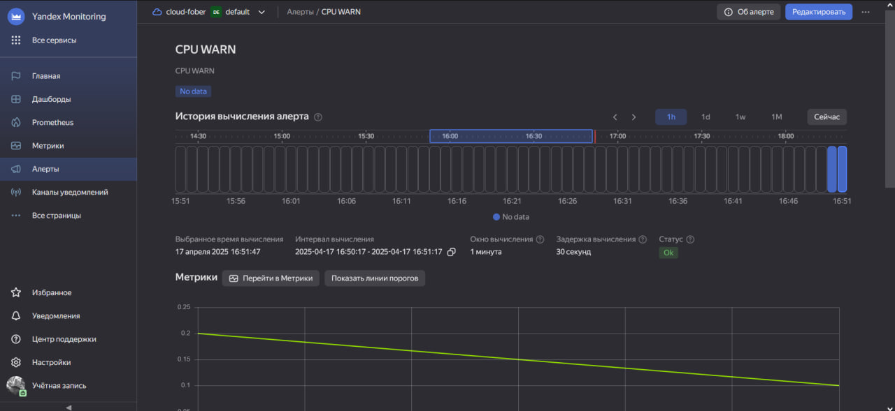
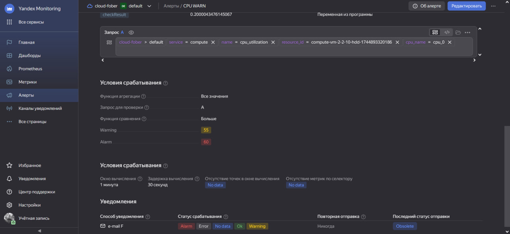
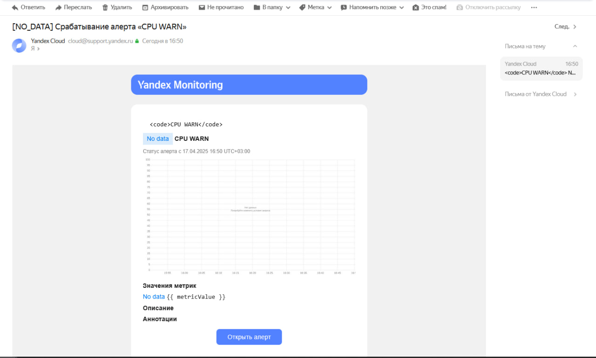
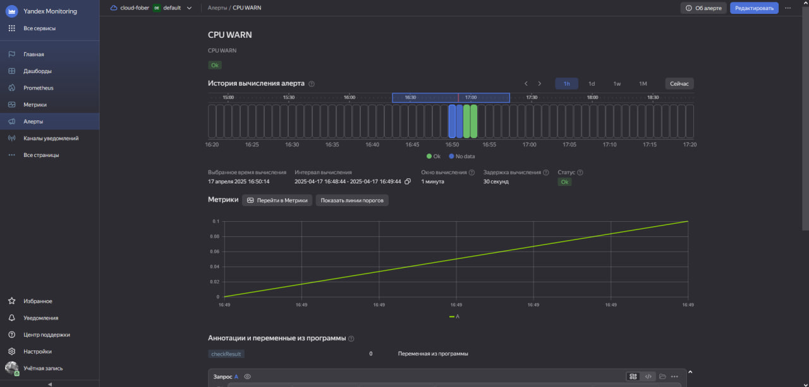

# Test_monitoring

## 📊 Яндекс.Метрика

Задание 1

Создайте виртуальную машину в Yandex Compute Cloud и с помощью Yandex Monitoring создайте дашборд, на котором будет видно загрузку процессора.
Процесс выполнения

    В окне браузера откройте облачную платформу Yandex Cloud
    Перейдите в раздел "Все сервисы" > "Инфраструктура и сеть" > "Compute Cloud"
    Нажмите на синюю кнопку "Создать ВМ" в правом верхнем углу окна браузера
    Задайте имя виртуальной машины. Используйте английские буквы и цифры.
    Выберите операционную систему Debian 11
    Установите объём HDD равный 3ГБ
    Выберите платформу Intel Ice Lake
    Установите количество vCPU равное 2
    Установите гарантированную долю vCPU равную 20%
    Задайте количество RAM равное 1ГБ
    Поставьте галочку "Прерываемая"
    В разделе "Доступ" выберите сервисный аккаунт с ролью monitoring.editor. Если такого аккаунта нету, нажмите на кнопку "Создать новый". Задайте имя аккаунта английскими буквами, напротив надписи "Роли в каталоге" нажмите на знак "плюс". Прокручивая колесо мыши на себя, найдите роль monitoring.editor и нажмите на неё левой кнопкой мыши. Теперь вы сможете найти только что созданную роль в выпадающем списке аккаунтов.
    Задайте логин учётной записи вашей виртуальной машины
    Вставьте публичный SHH-ключ в поле SSH-ключ. Если этого ключа у вас нету, создайте его с помощью утилиты PuTTYgen
    Поставьте галочку "Установить" в пункте "Агент сбора метрик"
    Нажмите на синюю кнопку "Создать ВМ"
    Перейдите в раздел "Все сервисы" > "Инфраструктура и сеть" > "Monitoring"
    Нажмите на кнопку "Создать дашборд", расположенную в разделе "Возможности сервиса" > "Дашборды"
    В открывшемся окне в разделе "Добавить виджет" нажмите на "График"
    Пред вам предстанет конструктор запросов, выберите "Запрос А"
    В параметре service конструктора запросов выберите Compute Cloud
    В появившемся параметре name конструктора запросов выберите cpu_utilization
    Поправьте диапазон времени отрисовки графика нажав на кнопку "Сейчас" в верху экрана, левее кнопок 3m, 1h, 1d, 1w, "Отменить".
    Нажмите на кнопку "Сохранить" в правом верхнем углу экрана
    Задайте имя дашборда, если появится окно ввода имени дашборда
    Сделайте скриншот

Требования к результату

    прикрепите в файл README.md скриншот вашего дашборда в Yandex Monitoring с мониторингом загрузки процессора виртуальной машины.

Задание 2

С помощью Yandex Monitoring сделайте 2 алерта на загрузку процессора: WARN и ALARM. Создайте уведомление по e-mail.
Требования к результату

    прикрепите в файл README.md скриншот уведомления в Yandex Monitoring

### Скриншоты

### 🔧 Шаг 1: Главная страница Yandex Monitoring

### 📈 Шаг 2: Создание алерта на WARN 

### 🚨 Шаг 3: Создание алерта на ALARM 

### 📬 Шаг 4: Настройка уведомлений по e-mail

